# Benchmark

## Prepare

The function `unique_strings()` generates a vector of unique strings. It
simply uses **digest** package to generate MD5 hashes of R objects.

``` r

library(hashtable)
library(microbenchmark)
library(digest)
unique_strings = function(k) {
    sapply(seq_len(k), digest)
}
unique_strings(2)
```

    ## [1] "4b5630ee914e848e8d07221556b0a2fb" "c01f179e4b57ab8bd9de309e6d576c48"

`bm()` is only for simplifying code demo in this document.

``` r

bm = function(...) {
    mean(microbenchmark(..., times = 25)$time)
}
```

There are the following packages implementing hash tables:

- **hash**, using environment,
- **hashmapR**, using C++ library `std::unordered_map`,
- **r2r**, using environment.

There are also other indirect hash table implementations:

- [`list2env()`](https://rdrr.io/r/base/list2env.html), converting a
  list to an environment.
- **fastmatch**, matching between two character vectors where a hash
  table is internally computated and attached to one character vector.

We compare the performance of creating, querying, deleting and inserting
keys of **hashtable** and other methods.

## Create hash tables

There are two implementations of hash tables in **hashtable**:

- [`hash_table()`](../reference/hash_table.md), using C++ library
  `std::unordered_map`,
- [`hash_fm_table()`](../reference/hash_fm.md), using **fastmatch**,
- [`hash_env_table()`](../reference/hash_env.md), using environment.

We test hash tables with size from 10K keys to 100K keys.

``` r

size = seq(10000L, 100000L, by = 10000L)
```

[`list2env()`](https://rdrr.io/r/base/list2env.html) expects the input
as a named list.
[`hashmapR::hashmap()`](https://rdrr.io/pkg/hashmapR/man/hashmap.html)
expects keys and values all specified as lists.
[`r2r::hashmap()`](https://rdrr.io/pkg/r2r/man/hashtable.html) creates
the hash table in two steps: create an empty object then fill key-value
pairs. Note format preparation is not included in estimating runtime of
benchmarking functions.

``` r

t1 = t2 = t3 = t4 = t5 = t6 = t7 = numeric(length(size))
for(i in seq_along(size)) {
    keys = unique_strings(size[i])
    values = seq_len(size[i])

    t1[i] = bm(hash_table(keys = keys, values = values))
    t2[i] = bm(hash_fm_table(keys = keys, values = values))
    t3[i] = bm(hash_env_table(keys = keys, values = values))
    
    lt = split(values, keys)
    parent_env = emptyenv()
    t4[i] = bm(list2env(lt, hash = TRUE, parent = parent_env))
    t5[i] = bm(hash::hash(keys = keys, values = values))

    lt_keys = split(keys, keys)
    lt_values = split(values, keys)
    t6[i] = bm({h = hashmapR::hashmap(); h$set(lt_keys, lt_values, vectorize = TRUE)})
    t7[i] = bm({h = r2r::hashmap(); h[keys] = values})
}
matplot(size, cbind(t1, t2, t3, t4, t5, t6, t7)/1000, type = "o", 
    lty = 1, col = 1:7, pch = 16, cex = 0.5, 
    xlab = "size", ylab = "microseconds", main = "Create hash tables")
legend("topleft", lty = 1, col = 1:7, 
    legend = c("hash_table", "hash_fm_table", "hash_env_table", "list2env", "hash", "hashmapR", "r2r"))
```

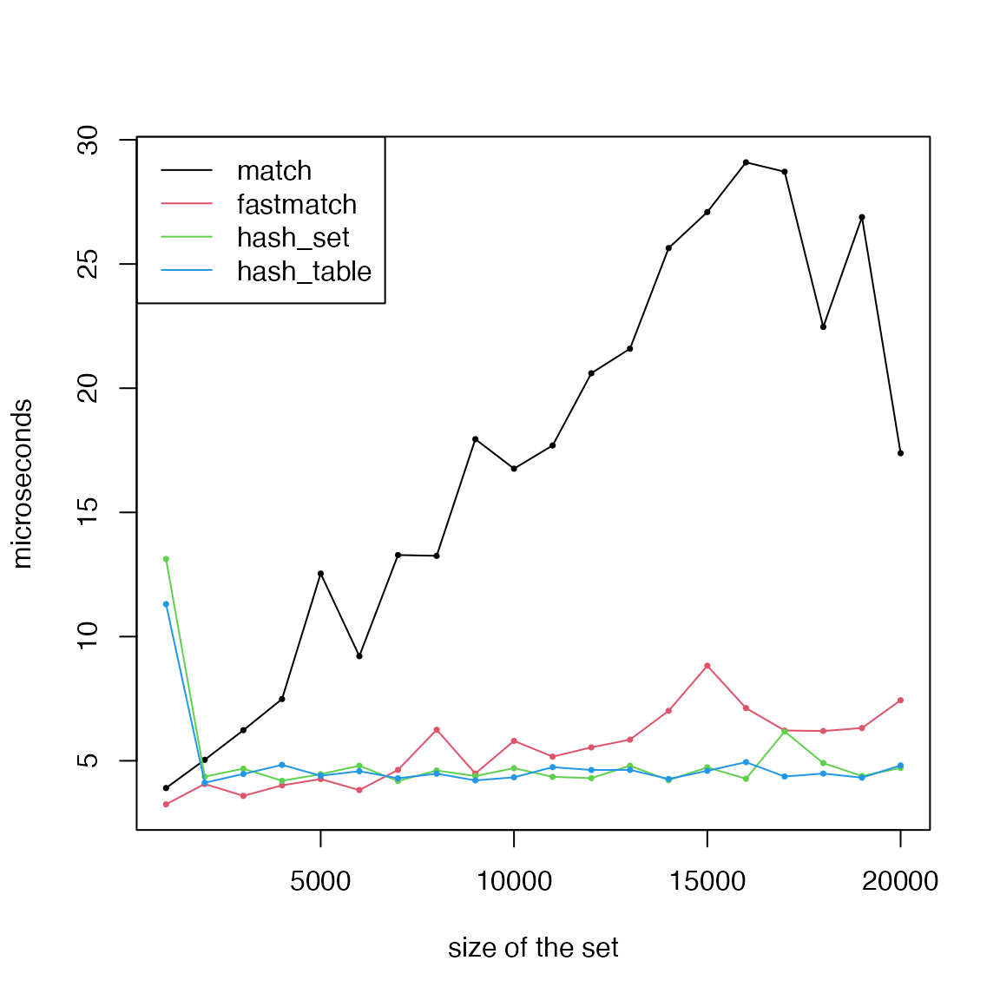

Obviously, **hashtable** is the fastest to create hash tables.

## Query

Query a single key. Except **hashmapR**, all hash table objects created
by various methods support `[[` index to get a single value.

``` r

t1 = t2 = t3 = t4 = t5 = t6 = t7 = numeric(length(size))
for(i in seq_along(size)) {
    keys = unique_strings(size[i])
    values = seq_along(keys)

    h1 = hash_table(keys = keys, values = values)
    h2 = hash_fm_table(keys = keys, values = values)
    h3 = hash_env_table(keys = keys, values = values)
    
    lt = split(values, keys)
    h4 = list2env(lt, hash = TRUE, parent = emptyenv())

    h5 = hash::hash(keys = keys, values = values)
    
    h6 = hashmapR::hashmap()
    h6$set(split(keys, keys), split(values, keys), vectorize = TRUE)

    h7 = r2r::hashmap()
    h7[keys] = values

    t1[i] = bm(h1[[sample(keys, 1)]])
    t2[i] = bm(h2[[sample(keys, 1)]])
    t3[i] = bm(h3[[sample(keys, 1)]])
    t4[i] = bm(h4[[sample(keys, 1)]])
    t5[i] = bm(h5[[sample(keys, 1)]])
    t6[i] = bm(h6$get(sample(keys, 1)))
    t7[i] = bm(h7[[sample(keys, 1)]])
}
matplot(size, cbind(t1, t2, t3, t4, t5, t6, t7)/1000, type = "o", 
    lty = 1, col = 1:7, pch = 16, cex = 0.5, 
    xlab = "size", ylab = "microseconds", main = "Query a single key")
legend("topleft", lty = 1, col = 1:7, 
    legend = c("hash_table", "hash_fm_table", "hash_env_table", "list2env", "hash", "hashmapR", "r2r"))
```

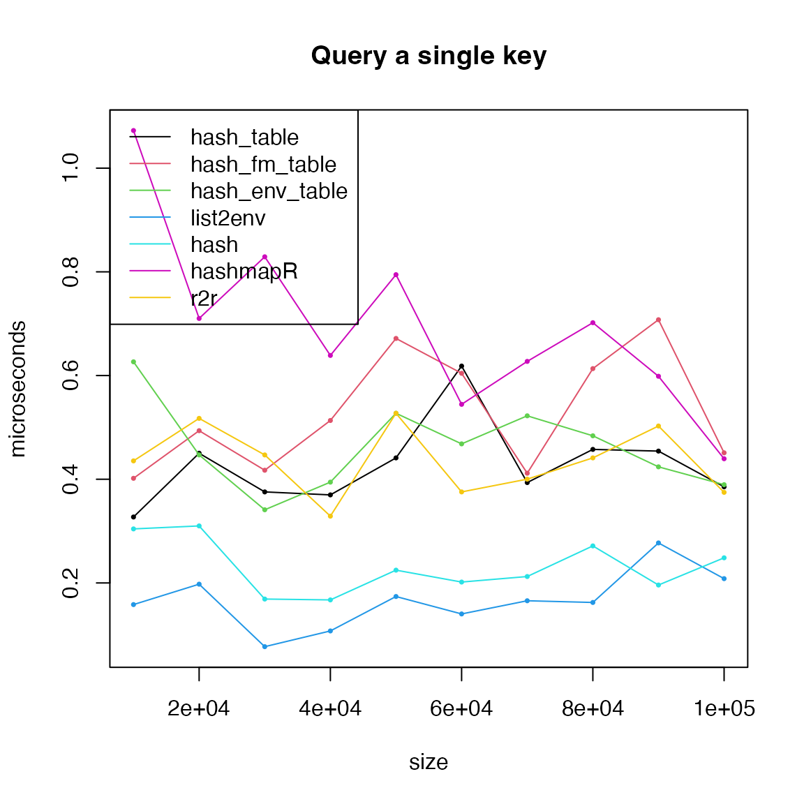

All hash-functions have similar performance. The small difference of
runtime is due to their specific implementations, e.g., **hashtable**
implements functions using S4, so it needs a little bit more steps on
method dispatch.

Query multiple keys. We use [`mget()`](https://rdrr.io/r/base/get.html)
to get multiple values from an environment. Many methods support `[`
index to get multiple values.

``` r

par(mfrow = c(2, 2))
for(p in c(0.01, 0.1, 0.25, 0.5)) {
    t1 = t2 = t3 = t4 = t5 = t6 = t7 = numeric(length(size))
    for(i in seq_along(size)) {
        keys = unique_strings(size[i])
        values = seq_along(keys)

        h1 = hash_table(keys = keys, values = values)
        h2 = hash_fm_table(keys = keys, values = values)
        h3 = hash_env_table(keys = keys, values = values)
        
        lt = split(values, keys)
        h4 = list2env(lt, hash = TRUE, parent = emptyenv())

        h5 = hash::hash(keys = keys, values = values)
        
        h6 = hashmapR::hashmap()
        h6$set(split(keys, keys), split(values, keys), vectorize = TRUE)

        h7 = r2r::hashmap()
        h7[keys] = values

        t1[i] = bm(h1[sample(keys, round(p*size[i]))])
        t2[i] = bm(h2[sample(keys, round(p*size[i]))])
        t3[i] = bm(h3[sample(keys, round(p*size[i]))])
        t4[i] = bm(mget(sample(keys, round(p*size[i])), h4))
        t5[i] = bm(h5[sample(keys, round(p*size[i]))])
        t6[i] = bm(h6$get(sample(keys, round(p*size[i]))))
        t7[i] = bm(h7[sample(keys, round(p*size[i]))])
    }
    matplot(size, cbind(t1, t2, t3, t4, t5, t6, t7)/1000, type = "o", 
        lty = 1, col = 1:6, pch = 16, cex = 0.5, 
        xlab = "size", ylab = "microseconds", main = paste0("Query multiple keys, ", p*100, "%"))
    legend("topleft", lty = 1, col = 1:6, 
        legend = c("hash_table", "hash_fm_table", "hash_env_table", "list2env", "hash", "hashmapR", "r2r"))
}
```

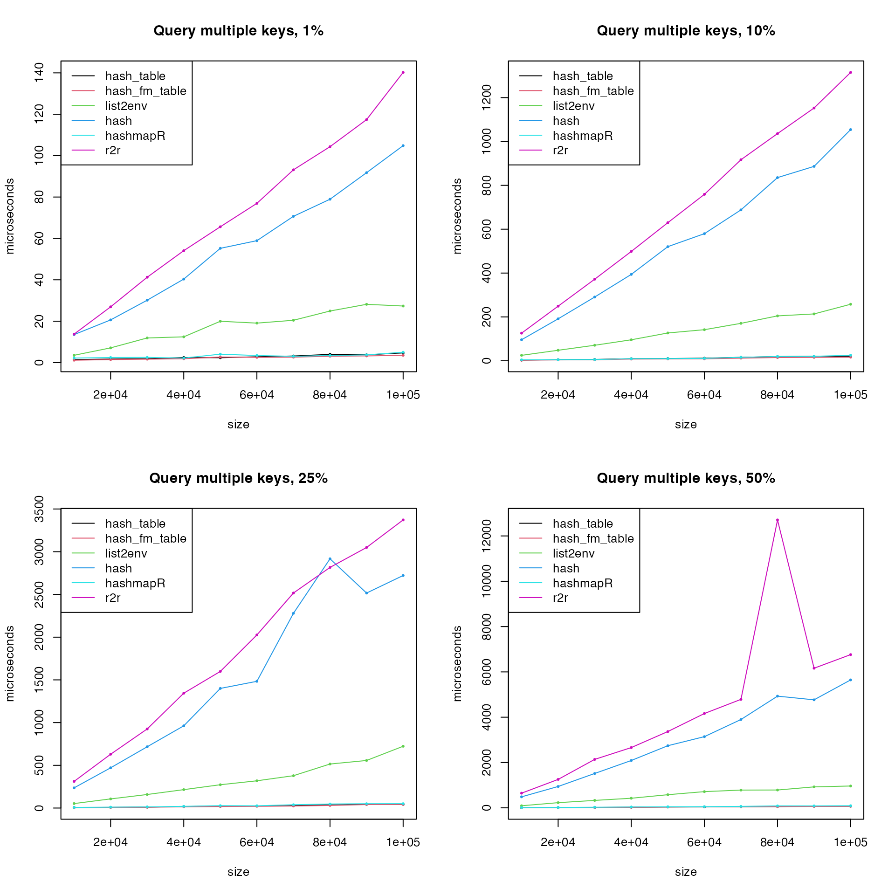

**r2r** and **hash** performs badly when querying multiple keys. Remove
`r2r`, `hash()` also remove two environment-functions
[`list2env()`](https://rdrr.io/r/base/list2env.html) and
[`hash_env_table()`](../reference/hash_env.md), then remake the last
plot:

``` r

matplot(size, cbind(t1, t2, t6)/1000, type = "o", 
    lty = 1, col = c(1:2, 6), pch = 16, cex = 0.5, 
    xlab = "size", ylab = "microseconds", main = paste0("Query multiple keys, ", p*100, "%"))
legend("topleft", lty = 1, col = c(1:2, 6), 
    legend = c("hash_table", "hash_fm_table", "hashmapR"))
```

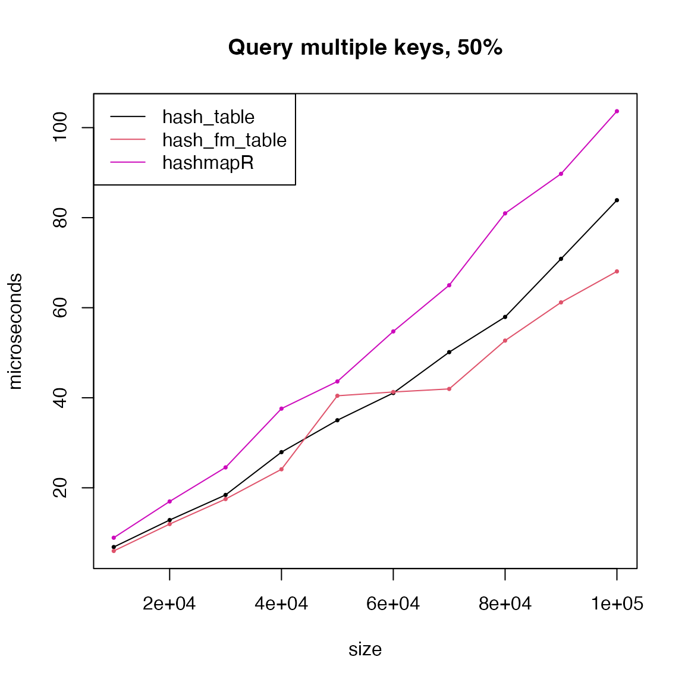

## Insertion

Except **hashmapR**, all hash table objects created by various methods
support `[[<-` to set a single value. Note
[`hash_fm_table()`](../reference/hash_fm.md) is not incluced because it
does not allow to insert new keys.

Note `unique_strings()` is based on MD5 hashes of integers, `rnorm(1)`
generates nuemric values, so `digest(rnorm(1))` generate new keys.

``` r

t1 = t3 = t4 = t5 = t6 = t7 = numeric(length(size))
for(i in seq_along(size)) {
    keys = unique_strings(size[i])
    values = seq_along(keys)

    h1 = hash_table(keys = keys, values = values)
    h3 = hash_env_table(keys = keys, values = values)
    
    lt = split(values, keys)
    h4 = list2env(lt, hash = TRUE, parent = emptyenv())

    h5 = hash::hash(keys = keys, values = values)
    
    h6 = hashmapR::hashmap()
    h6$set(split(keys, keys), split(values, keys), vectorize = TRUE)

    h7 = r2r::hashmap()
    h7[keys] = values
    
    t1[i] = bm(h1[[digest(rnorm(1))]] <- 1L)
    t3[i] = bm(h3[[digest(rnorm(1))]] <- 1L)
    t4[i] = bm(h4[[digest(rnorm(1))]] <- 1L)
    t5[i] = bm(h5[[digest(rnorm(1))]] <- 1L)
    t6[i] = bm(h6$set(digest(rnorm(1)), 1L))
    t7[i] = bm(h7[[digest(rnorm(1))]] <- 1L)
}
matplot(size, cbind(t1, t3, t4, t5, t6, t7)/1000, type = "o", 
    lty = 1, col = c(1, 3:7), pch = 16, cex = 0.5, 
    xlab = "size", ylab = "microseconds", main = "Insert a single key")
legend("topleft", lty = 1, col = c(1, 3:7), 
    legend = c("hash_table", "hash_env_table", "list2env", "hash", "hashmapR", "r2r"))
```

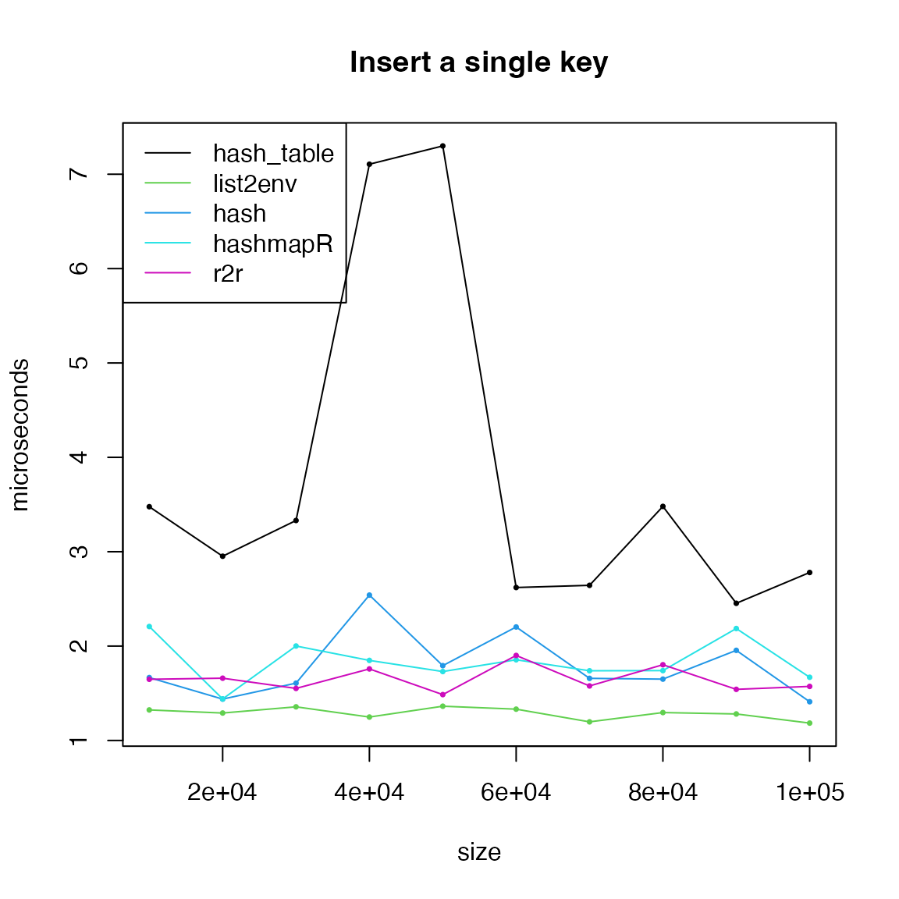

## Deletion

Difference methods have different interfaces to delete key-value pairs.
[`hash_fm_table()`](../reference/hash_fm.md) is not incluced because it
does not allow to delete keys.

``` r

t1 = t3 = t4 = t5 = t6 = t7 = numeric(length(size))
for(i in seq_along(size)) {
    keys = unique_strings(size[i])
    values = seq_along(keys)

    h1 = hash_table(keys = keys, values = values)
    h3 = hash_env_table(keys = keys, values = values)
    
    lt = split(values, keys)
    h4 = list2env(lt, hash = TRUE, parent = emptyenv())

    h5 = hash::hash(keys = keys, values = values)
    
    h6 = hashmapR::hashmap()
    h6$set(split(keys, keys), split(values, keys), vectorize = TRUE)

    h7 = r2r::hashmap()
    h7[keys] = values
    
    t1[i] = bm(hash_delete(h1, sample(keys, 1)))
    t3[i] = bm(hash_delete(h3, sample(keys, 1)))
    t4[i] = bm(rm(list = sample(keys, 1), h4))
    t5[i] = bm(hash::delete(sample(keys, 1), h5))
    t6[i] = bm(h6$remove(sample(keys, 1)))
    t7[i] = bm(r2r::delete(h7, sample(keys, 1)))
}
matplot(size, cbind(t1, t3, t4, t5, t6, t7)/1000, type = "o", 
    lty = 1, col = c(1, 3:7), pch = 16, cex = 0.5, 
    xlab = "size", ylab = "microseconds", main = "Delete a single key")
legend("left", lty = 1, col = c(1, 3:7), 
    legend = c("hash_table", "hash_env_table", "list2env", "hash", "hashmapR", "r2r"))
```

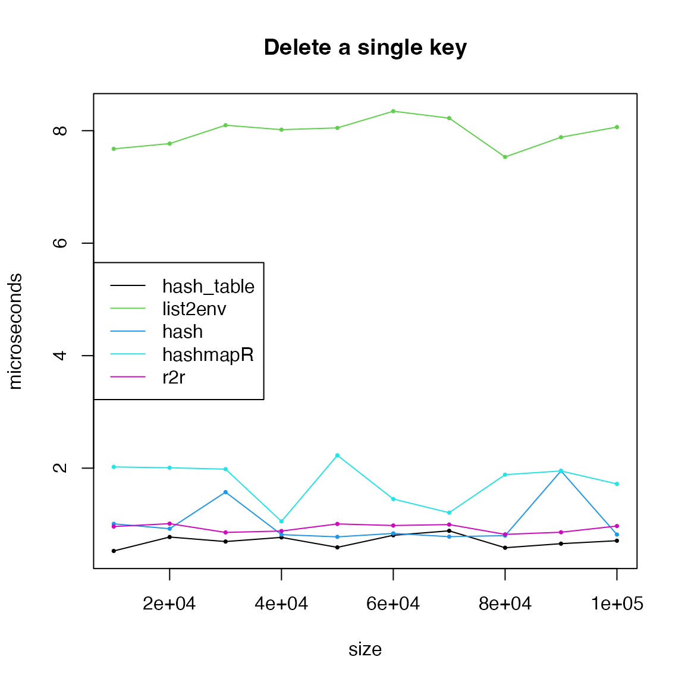

[`list2env()`](https://rdrr.io/r/base/list2env.html) performs obviously
bad.

## Compare to match-family functions

People may think named vectors (including lists) behave like hashes.

``` r

vec = c("foo" = 1, "bar" = 2)
vec
```

    ## foo bar 
    ##   1   2

``` r

vec[["foo"]]
```

    ## [1] 1

``` r

lt = list("foo" = 1, "bar" = "text")
lt$foo
```

    ## [1] 1

Actually they are not. Names are just normal character vectors, but
attached to the object as an attributes.

``` r

attributes(vec)
```

    ## $names
    ## [1] "foo" "bar"

``` r

attributes(lt)
```

    ## $names
    ## [1] "foo" "bar"

So using names as indices basically does matching in the “names”
attributes.

There are following match-family functions:

- [`pmatch()`](https://rdrr.io/r/base/pmatch.html), used in
  [`names()`](https://rdrr.io/r/base/names.html), `$`, `[[`, `[`,
- [`match()`](https://rdrr.io/r/base/match.html), used in `%in%`,
  [`intersect()`](https://rdrr.io/r/base/sets.html),
  [`unique()`](https://rdrr.io/r/base/unique.html),
  [`duplicated()`](https://rdrr.io/r/base/duplicated.html),
- [`fastmatch::fastmatch()`](https://rdrr.io/pkg/fastmatch/man/fmatch.html),
  a faster version of [`match()`](https://rdrr.io/r/base/match.html),
  synonyms functions are
  [`fmatch()`](https://rdrr.io/pkg/fastmatch/man/fmatch.html) and
  `%fin%`,
- [`data.table::chmatch()`](https://rdrr.io/pkg/data.table/man/chmatch.html),
  also a faster version of
  [`match()`](https://rdrr.io/r/base/match.html), synonyms functions are
  [`chmatch()`](https://rdrr.io/pkg/data.table/man/chmatch.html) and
  `%chin%`.

[`pmatch()`](https://rdrr.io/r/base/pmatch.html) means partial matching.
It matches elements if substrings can be uniquely mapped.

In **hashtable**, the function
[`hash_fm_table()`](../reference/hash_fm.md) is internally implemented
with
[`fastmatch::fastmatch()`](https://rdrr.io/pkg/fastmatch/man/fmatch.html),
but providing a more convenient interface.

``` r

library(fastmatch)
library(data.table)
t1 = t2 = t3 = t4 = t5 = t6 = t7 = t8 = numeric(length(size))
for(i in seq_along(size)) {
    keys = unique_strings(size[i])
    values = seq_along(keys)

    x = structure(values, names = keys)

    h1 = hash_table(keys = keys, values = values)
    h2 = hash_fm_table(keys = keys, values = values)
    h3 = hash_env_table(keys = keys, values = values)

    t1[i] = bm(h1[[sample(keys, 1)]])
    t2[i] = bm(h2[[sample(keys, 1)]])

    h6 = hashmapR::hashmap()
    h6$set(split(keys, keys), split(values, keys), vectorize = TRUE)
    t6[i] = bm(h6$get(sample(keys, 1)))

    t4[i] = bm(x[[sample(keys, 1)]])
    t5[i] = bm(x[[match(sample(keys, 1), keys)]])
    t7[i] = bm(x[[fmatch(sample(keys, 1), keys)]])
    t8[i] = bm(x[[chmatch(sample(keys, 1), keys)]])
}
matplot(size, cbind(t1, t2, t3, t6, t4, t5, t7, t8)/1000, type = "o", 
    lty = 1, col = c(1:3, 6, 4, 5, 7, 8), pch = 16, cex = 0.5, 
    xlab = "size", ylab = "microseconds", main = "Query a single key, match-family")
legend("topleft", lty = 1, col = c(1:3, 6, 4, 5, 7, 8), 
    legend = c("hash_table", "hash_fm_table", "hash_env_table", "hashmapR", "pmatch/names", "match", "fmatch", "chmatch"))
```

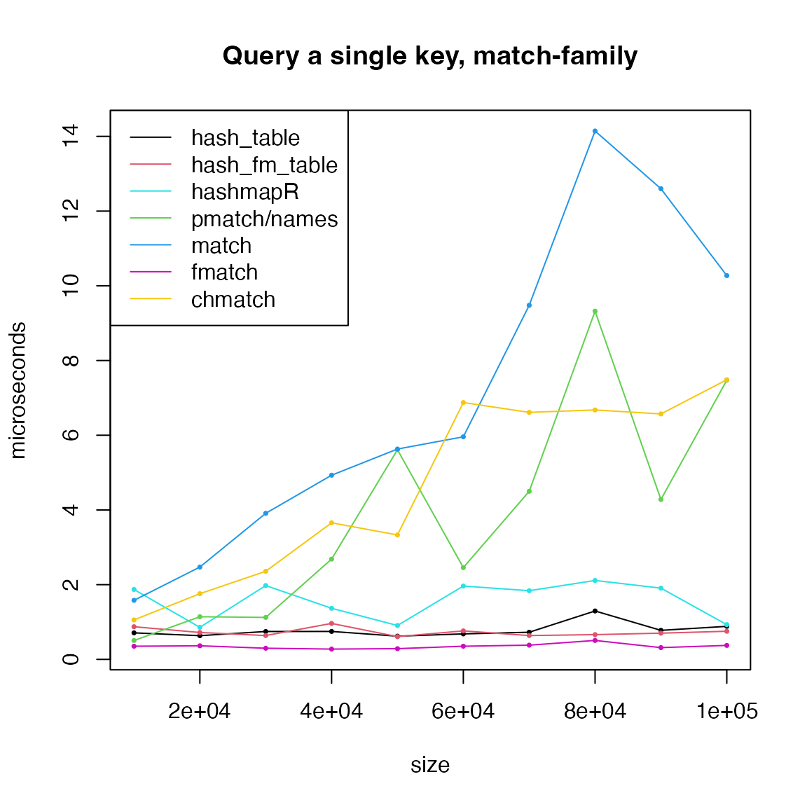

We can see hash-family functions have time complexity of $`O(1)`$,
[`pmatch()`](https://rdrr.io/r/base/pmatch.html),
[`match()`](https://rdrr.io/r/base/match.html) and
[`chmatch()`](https://rdrr.io/pkg/data.table/man/chmatch.html) have
$`O(n)`$.

Next query multiple keys with match-family functions.

``` r

par(mfrow = c(2, 2))
for(p in c(0.01, 0.1, 0.25, 0.5)) {
    t1 = t2 = t3 = t4 = t5 = t6 = t7 = numeric(length(size))
    for(i in seq_along(size)) {
        keys = unique_strings(size[i])
        values = seq_along(keys)

        x = structure(values, names = keys)

        h1 = hash_table(keys = keys, values = values)
        h2 = hash_fm_table(keys = keys, values = values)
        h3 = hash_env_table(keys = keys, values = values)

        t1[i] = bm(h1[sample(keys, round(p*size[i]))])
        t2[i] = bm(h2[sample(keys, round(p*size[i]))])
        t3[i] = bm(h3[sample(keys, round(p*size[i]))])

        h6 = hashmapR::hashmap()
        h6$set(split(keys, keys), split(values, keys), vectorize = TRUE)
        t6[i] = bm(h6$get(sample(keys, round(p*size[i]))))
            
        t4[i] = bm(x[sample(keys, round(p*size[i]))])
        t5[i] = bm(x[match(sample(keys, round(p*size[i])), keys)])
        t7[i] = bm(x[fmatch(sample(keys, round(p*size[i])), keys)])
        t8[i] = bm(x[chmatch(sample(keys, round(p*size[i])), keys)])
    }
    matplot(size, cbind(t1, t2, t3, t6, t4, t5, t7, t8)/1000, type = "o", 
        lty = 1, col = c(1:3, 6, 4, 5, 7, 8), pch = 16, cex = 0.5, 
        xlab = "size", ylab = "microseconds", main = paste0("Query multiple keys, match-family, ", p*100, "%"))
    legend("topleft", lty = 1, col = c(1:3, 6, 4, 5, 7, 8), 
        legend = c("hash_table", "hash_fm_table", "hash_env_table", "hashmapR", "names/pmatch", "match", "fmatch", "chmatch"))
}
```

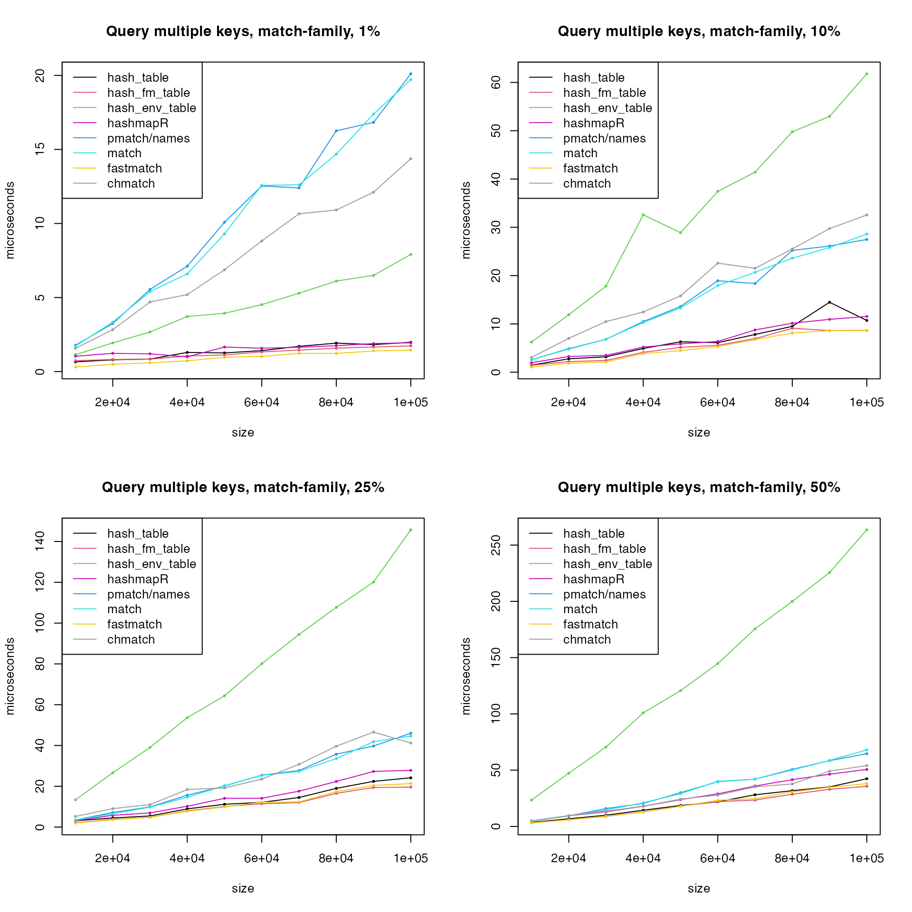

Remove [`hash_env_table()`](../reference/hash_env.md) and remake the
last plot.new

``` r

matplot(size, cbind(t1, t2, t6, t4, t5, t7, t8)/1000, type = "o", 
    lty = 1, col = c(1:3, 6, 4, 5, 7, 8), pch = 16, cex = 0.5, 
    xlab = "size", ylab = "microseconds", main = paste0("Query multiple keys, match-family, ", p*100, "%"))
legend("topleft", lty = 1, col = c(1:3, 6, 4, 5, 7, 8), 
    legend = c("hash_table", "hash_fm_table", "hashmapR", "names/pmatch", "match", "fmatch", "chmatch"))
```

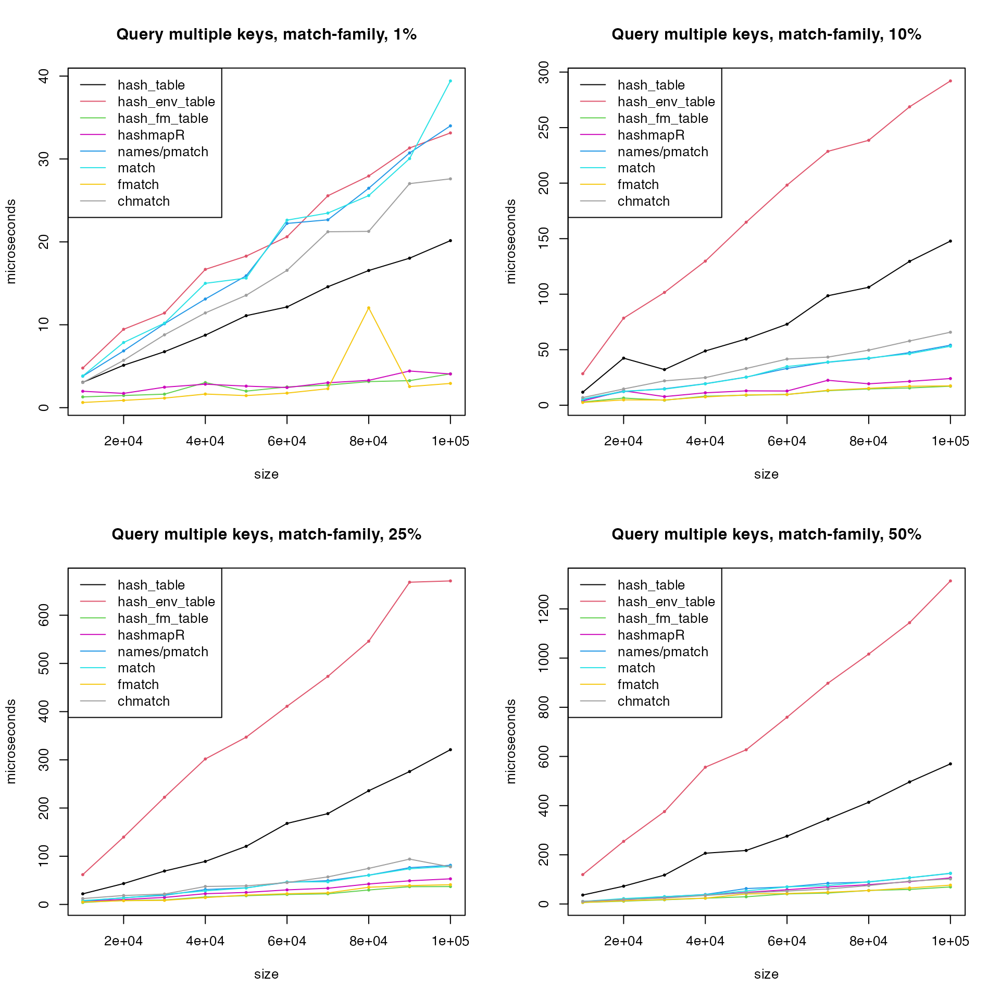

## Hash set

Hash set is basically very similar as hash table. The only difference is
for hash table, there are values associated with keys, while for hash
set, there are only keys.

We first test querying a single key, which is to test whether the key
exists in the hash set.

``` r

t1 = t2 = t3 = t4 = t5 = t6 = t7 = numeric(length(size))
for(i in seq_along(size)) {
    keys = unique_strings(size[i])

    h1 = hash_set(keys)
    h2 = hash_fm_set(keys)
    h3 = hash_env_set(keys)
    h7 = r2r::hashset(keys)

    t1[i] = bm(h1[[sample(keys, 1)]])
    t2[i] = bm(h2[[sample(keys, 1)]])
    t3[i] = bm(h3[[sample(keys, 1)]])
    t7[i] = bm(h7[[sample(keys, 1)]])

    t4[i] = bm(match(sample(keys, 1), keys))
    t5[i] = bm(fmatch(sample(keys, 1), keys))
    t6[i] = bm(chmatch(sample(keys, 1), keys))
}
matplot(size, cbind(t1, t2, t3, t7, t4, t5, t6)/1000, type = "o", 
    lty = 1, col = c(1:3, 7, 4:6), pch = 16, cex = 0.5, 
    xlab = "size", ylab = "microseconds", main = "Query a single key")
legend("topleft", lty = 1, col = c(1:3, 7, 4:6), 
    legend = c("hash_set", "hash_fm_set", "hash_env_set", "r2r", "match", "fastmatch", "chmatch"))
```

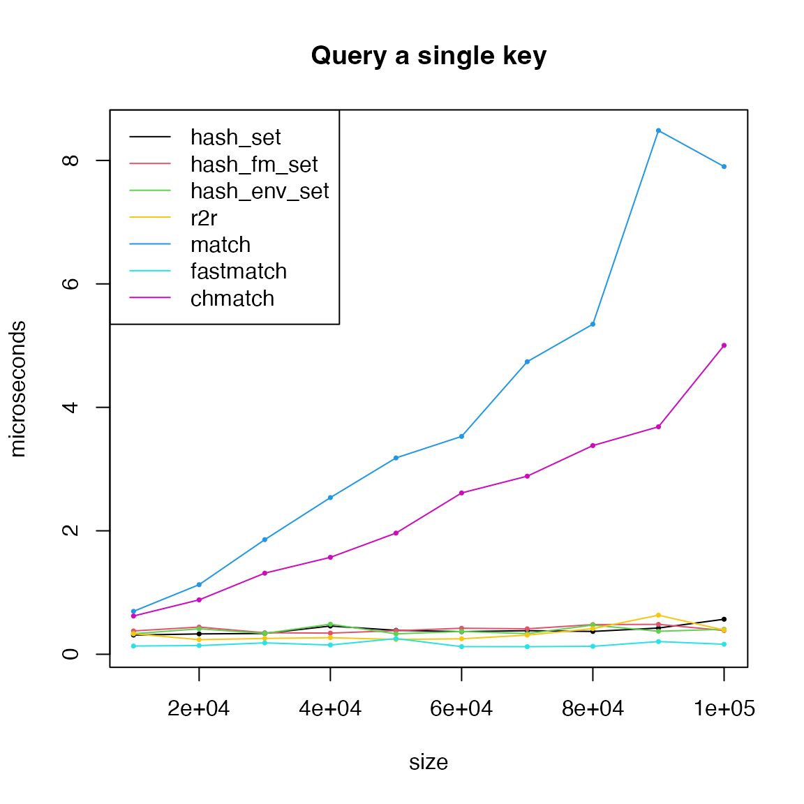

[`match()`](https://rdrr.io/r/base/match.html) and
[`chmatch()`](https://rdrr.io/pkg/data.table/man/chmatch.html) are not
hash-functions. We remove them and remake the last plot.

``` r

matplot(size, cbind(t1, t2, t3, t7, t5)/1000, type = "o", 
    lty = 1, col = c(1:3, 7, 5), pch = 16, cex = 0.5, 
    xlab = "size", ylab = "microseconds", main = "Query a single key")
legend("topleft", lty = 1, col = c(1:3, 7, 5), 
    legend = c("hash_set", "hash_fm_set", "hash_env_set", "r2r", "fastmatch"))
```

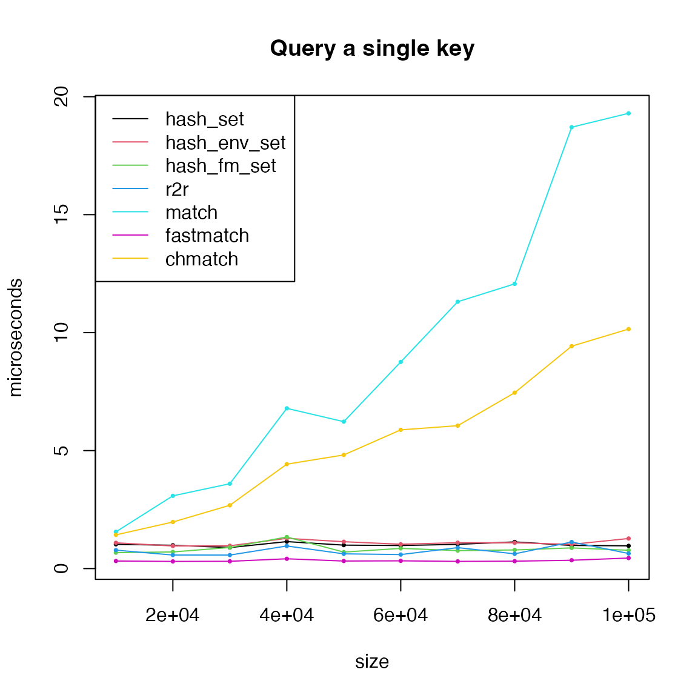

Next query multiple keys.

``` r

par(mfrow = c(2, 2))
for(p in c(0.01, 0.1, 0.25, 0.5)) {
    t1 = t2 = t3 = t4 = t5 = t6 = t7 = numeric(length(size))
    for(i in seq_along(size)) {
        keys = unique_strings(size[i])

        h1 = hash_set(keys)
        h2 = hash_fm_set(keys)
        h3 = hash_env_set(keys)
        h7 = r2r::hashset(keys)

        t1[i] = bm(h1[sample(keys, round(p*size[i]))])
        t2[i] = bm(h2[sample(keys, round(p*size[i]))])
        t3[i] = bm(h3[sample(keys, round(p*size[i]))])
        t7[i] = bm(h7[sample(keys, round(p*size[i]))])

        t4[i] = bm(match(sample(keys, round(p*size[i])), keys))
        t5[i] = bm(fmatch(sample(keys, round(p*size[i])), keys))
        t6[i] = bm(chmatch(sample(keys, round(p*size[i])), keys))
    }
    matplot(size, cbind(t1, t2, t3, t7, t4, t5, t6)/1000, type = "o", 
        lty = 1, col = c(1:3, 7, 4:5), pch = 16, cex = 0.5, 
        xlab = "size", ylab = "microseconds", main = paste0("Query multiple keys, ", p*100, "%"))
    legend("topleft", lty = 1, col = c(1:3, 7, 4:6), 
        legend = c("hash_set", "hash_fm_set", "hash_env_set", "r2r", "match", "fastmatch", "chmatch"))
}
```

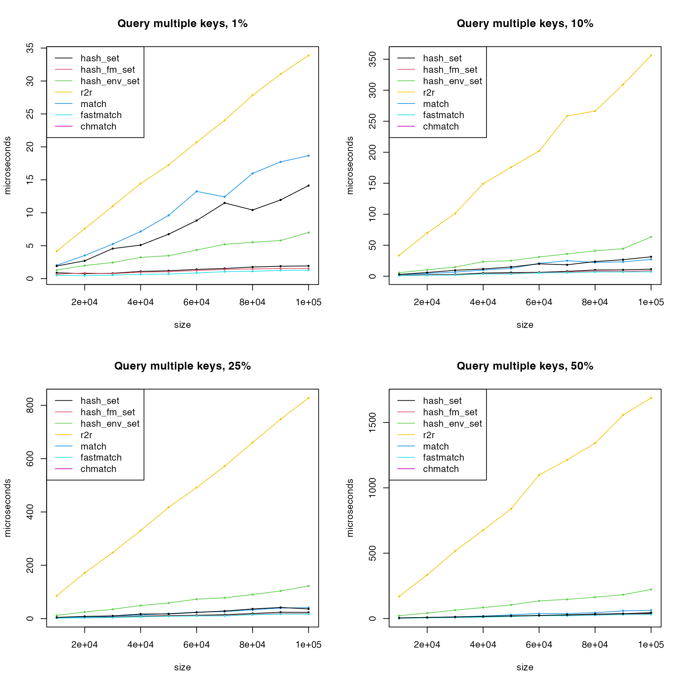

Obviously `r2r` has very bad performance when querying multiple keys.
Remove `r2r` also [`hash_env_set()`](../reference/hash_env.md) and
remake the last plot.

``` r

matplot(size, cbind(t1, t2, t4, t5, t6)/1000, type = "o", 
    lty = 1, col = c(1:2, 4:6), pch = 16, cex = 0.5, 
    xlab = "size", ylab = "microseconds", main = paste0("Query multiple keys, ", p*100, "%"))
legend("topleft", lty = 1, col = c(1:2, 4:6), 
    legend = c("hash_set", "hash_fm_set", "match", "fastmatch", "chmatch"))
```

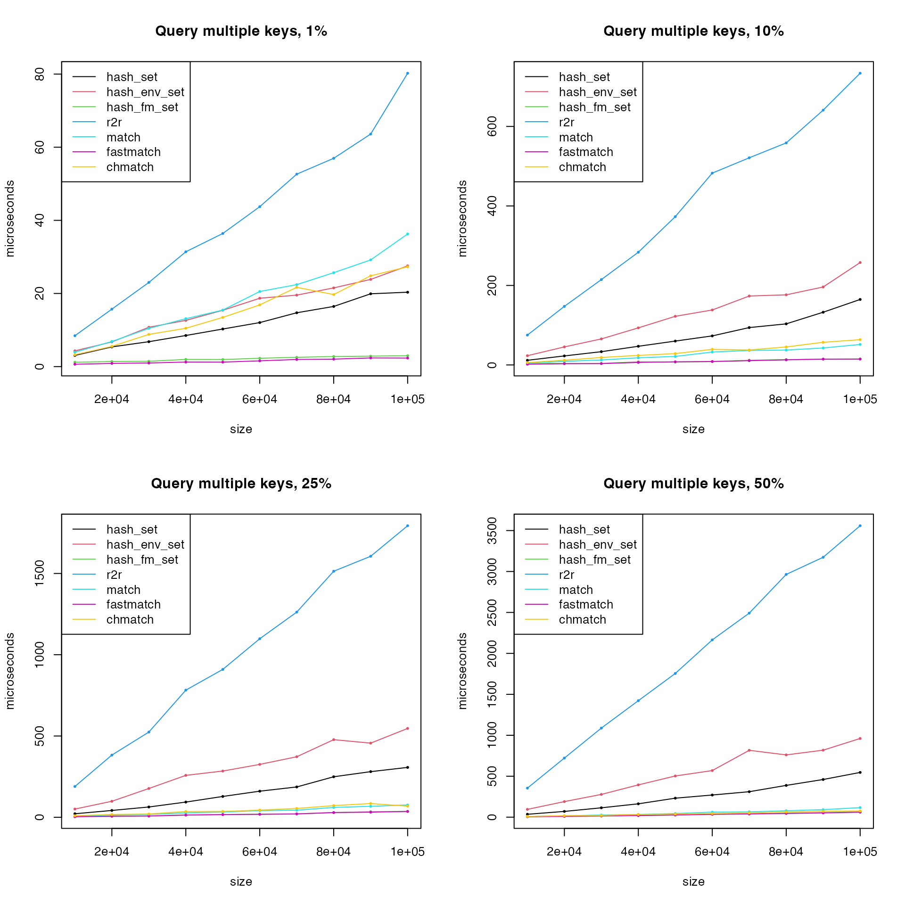

## Compare hash tables and hash sets

In **hashtable**, hash tables and hash sets are implements similarly in
the three implementations.

``` r

t1 = t2 = t3 = t4 = t5 = t6 = numeric(length(size))
for(i in seq_along(size)) {
    keys = unique_strings(size[i])
    values = seq_len(size[i])

    h1 = hash_table(keys = keys, values = values)
    h2 = hash_fm_table(keys = keys, values = values)
    h3 = hash_env_table(keys = keys, values = values)

    h4 = hash_set(keys = keys)
    h5 = hash_fm_set(keys = keys)
    h6 = hash_env_set(keys = keys)
    
    p = 0.1
    t1[i] = bm(h1[sample(keys, round(p*size[i]))])
    t2[i] = bm(h2[sample(keys, round(p*size[i]))])
    t3[i] = bm(h3[sample(keys, round(p*size[i]))])
    t4[i] = bm(h4[sample(keys, round(p*size[i]))])
    t5[i] = bm(h5[sample(keys, round(p*size[i]))])
    t6[i] = bm(h6[sample(keys, round(p*size[i]))])
}
matplot(size, cbind(t1, t2, t3, t4, t5, t6)/1000, type = "o", 
    lty = c(1, 1, 1, 2, 2, 2), col = c(1, 2, 3, 1, 2, 3), pch = 16, cex = 0.5, 
    xlab = "size", ylab = "microseconds", main = "Query multiple keys")
legend("topleft", lty = c(1, 1, 1, 2, 2, 2), col = c(1, 2, 3, 1, 2, 3), 
    legend = c("hash_table", "hash_fm_table", "hash_env_table", "hash_set", "hash_fm_set", "hash_env_set"))
```

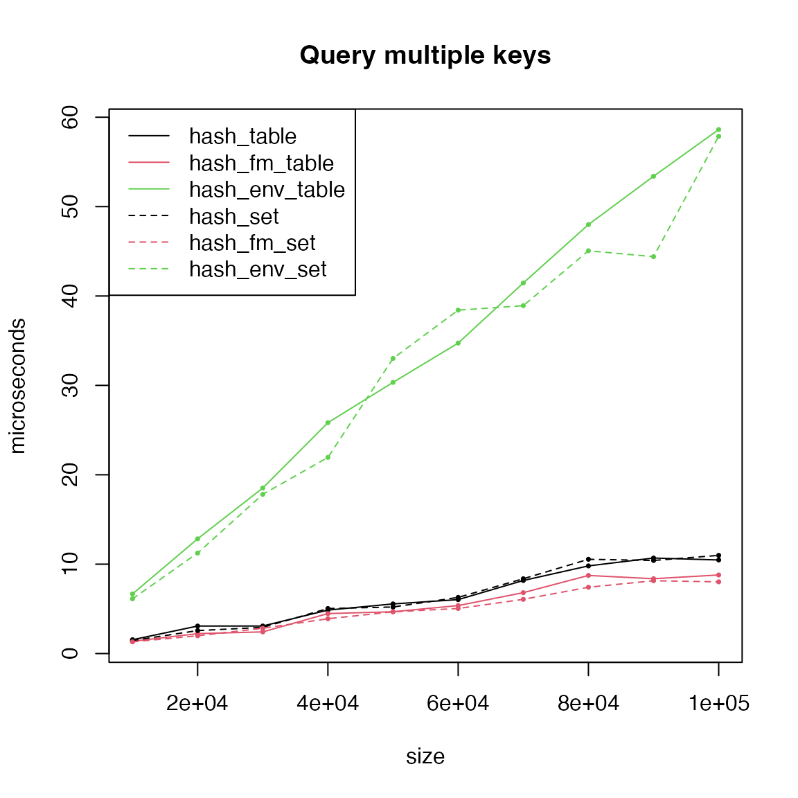

## Summarize

For creating hash tables, **hashtable** is fast.

For querying single keys, all hash-functions are fast, but the runtime
of [`pmatch()`](https://rdrr.io/r/base/pmatch.html),
[`match()`](https://rdrr.io/r/base/match.html) and
[`chmatch()`](https://rdrr.io/pkg/data.table/man/chmatch.html) increases
linearly to the size of the data.

For querying multiple keys, [`hash_fm_set()`](../reference/hash_fm.md)
and [`fmatch()`](https://rdrr.io/pkg/fastmatch/man/fmatch.html) is the
fastest. If hash tables are changable, then
[`hash_table()`](../reference/hash_table.md) and **hashmapR** can be
considered as replacement.

For inserting new keys, all hash-functions are similar.

For deleting keys, [`list2env()`](https://rdrr.io/r/base/list2env.html)
(which uses [`rm()`](https://rdrr.io/r/base/rm.html)) is relatively
slow, other functions are similar.

``` r

sessionInfo()
```

    ## R version 4.6.0 (2026-04-24)
    ## Platform: aarch64-apple-darwin23
    ## Running under: macOS Tahoe 26.5.1
    ## 
    ## Matrix products: default
    ## BLAS:   /Library/Frameworks/R.framework/Versions/4.6/Resources/lib/libRblas.0.dylib 
    ## LAPACK: /Library/Frameworks/R.framework/Versions/4.6/Resources/lib/libRlapack.dylib;  LAPACK version 3.12.1
    ## 
    ## locale:
    ## [1] en_GB.UTF-8/en_GB.UTF-8/en_GB.UTF-8/C/en_GB.UTF-8/en_GB.UTF-8
    ## 
    ## time zone: Asia/Shanghai
    ## tzcode source: internal
    ## 
    ## attached base packages:
    ## [1] stats     graphics  grDevices utils     datasets  methods   base     
    ## 
    ## other attached packages:
    ## [1] data.table_1.18.4    fastmatch_1.1-8      digest_0.6.39       
    ## [4] microbenchmark_1.5.0 hashtable_1.0.0      knitr_1.51          
    ## 
    ## loaded via a namespace (and not attached):
    ##  [1] cli_3.6.6         rlang_1.2.0       xfun_0.59         otel_0.2.0       
    ##  [5] textshaping_1.0.5 jsonlite_2.0.0    hash_2.2.6.4      htmltools_0.5.9  
    ##  [9] ragg_1.5.2        sass_0.4.10       rmarkdown_2.31    evaluate_1.0.5   
    ## [13] jquerylib_0.1.4   fastmap_1.2.0     yaml_2.3.12       lifecycle_1.0.5  
    ## [17] hashmapR_1.0.1    compiler_4.6.0    fs_2.1.0          htmlwidgets_1.6.4
    ## [21] Rcpp_1.1.1-1.1    systemfonts_1.3.2 R6_2.6.1          bslib_0.11.0     
    ## [25] tools_4.6.0       r2r_0.1.2         pkgdown_2.2.0     cachem_1.1.0     
    ## [29] desc_1.4.3
